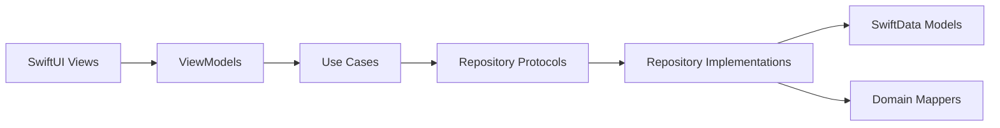

# ADR-001: SwiftData as Primary Storage Solution

**Status**: Accepted
**Date**: 2025-10-14
**Decision Makers**: iOS Development Team

## Context

WorkOut Log requires a local-first persistence layer for workout sessions, sets, exercises, and body metrics. The app needs to support complex relationships, offline functionality, and seamless integration with SwiftUI's reactive patterns.

## Decision

We will use **SwiftData** as the primary storage solution for WorkOut Log.

## Rationale

### Why SwiftData

1. **Native SwiftUI Integration**
   - First-class support for `@Observable` pattern (iOS 17+)
   - Automatic UI updates through `@Query` property wrapper
   - Type-safe predicate syntax with `#Predicate<Model>`

2. **Schema Evolution Support**
   - Built-in migration system with `VersionedSchema`
   - Explicit version control: v1 → v2 → v3
   - Safe schema changes for production apps

3. **Performance & Relationships**
   - Efficient relationship modeling with `@Relationship`
   - Lazy loading and relationship traversal
   - Query optimization with `FetchDescriptor`

4. **Swift 6 Compatibility**
   - Full strict concurrency support
   - `@MainActor` isolation for UI-bound operations
   - Type-safe async/await persistence operations

## Implementation Approach

### Schema Design
```swift
// v1: Basic workout tracking
@Model final class WorkoutSessionModel {
    var id: String
    var date: Date
    var note: String?
    @Relationship(deleteRule: .cascade) var sets: [SetRecordModel] = []
}

// v2: Exercise categories
@Model final class ExerciseModel {
    var categoryRaw: String  // ExerciseCategory.rawValue
    var lastUsedDate: Date?
}

// v3: Body metrics expansion
@Model final class BodyMetricModel {
    var bodyWeight: Double
    var bodyFatPercent: Double?
    var muscleMass: Double?
}
```

### Critical SwiftData Patterns
```swift
// ✅ CORRECT: Explicit generic predicates
let predicate = #Predicate<WorkoutSessionModel> { $0.date >= start }

// ✅ CORRECT: Property-based limits
var descriptor = FetchDescriptor<WorkoutSessionModel>(predicate: predicate)
descriptor.fetchLimit = 1

// ✅ CORRECT: Qualified sort descriptors
let sort = [SortDescriptor(\WorkoutSessionModel.date, order: .reverse)]
```

## Alternatives Considered

### Core Data
**Pros**: Mature, battle-tested, extensive documentation
**Cons**: Complex setup, NSManagedObject overhead, poor SwiftUI integration, verbose relationship syntax
**Verdict**: Rejected - legacy approach incompatible with modern SwiftUI patterns

### SQLite + FMDB/SQLite.swift
**Pros**: Full SQL control, predictable performance, lightweight
**Cons**: Manual relationship management, no automatic UI updates, verbose boilerplate
**Verdict**: Rejected - excessive development overhead for relationship-heavy data model

### Realm
**Pros**: Simple API, good relationship support, cross-platform
**Cons**: Third-party dependency, threading constraints, licensing considerations
**Verdict**: Rejected - prefer first-party solution for core persistence

### CloudKit + Local Cache
**Pros**: Built-in sync, Apple ecosystem integration
**Cons**: Network dependency, complex conflict resolution, limited offline support
**Verdict**: Deferred - consider for Week 4 cloud sync feature

## Trade-offs

### Accepted Trade-offs
1. **iOS 17+ Requirement**: SwiftData limits backward compatibility
2. **Early Adopter Risk**: Fewer community resources than Core Data
3. **Apple Ecosystem Lock-in**: Platform-specific solution

### Mitigations
1. **Repository Pattern**: Abstract SwiftData behind domain protocols
2. **Domain Mappers**: Clean conversion between SwiftData models and domain entities
3. **Comprehensive Testing**: Mock repositories for isolated unit tests

## Decision Record

### Key Requirements Met
- ✅ Local-first with offline support
- ✅ Complex relationship modeling (sessions → sets → exercises)
- ✅ Reactive UI updates through SwiftUI integration
- ✅ Type-safe queries and schema evolution
- ✅ Swift 6 strict concurrency compliance

### Architecture Integration


### Success Metrics
- **Developer Experience**: Reduced boilerplate compared to Core Data
- **Performance**: Sub-100ms query times for typical workouts
- **Reliability**: Zero data loss during schema migrations
- **Testability**: 80%+ domain layer test coverage with mock repositories

## Implementation Status

**Week 1**: ✅ Complete
- Basic SwiftData setup with WorkoutSession/SetRecord relationships
- Repository pattern implementation
- Domain mappers for clean separation

**Week 2**: 🚧 In Progress
- Schema v2 migration for exercise categories
- Body metrics schema v3 integration

**Week 3**: 📋 Planned
- Performance optimization and indexing
- Advanced query patterns for analytics features

---

**Last Updated**: 2025-10-14
**Next Review**: End of Week 2 implementation