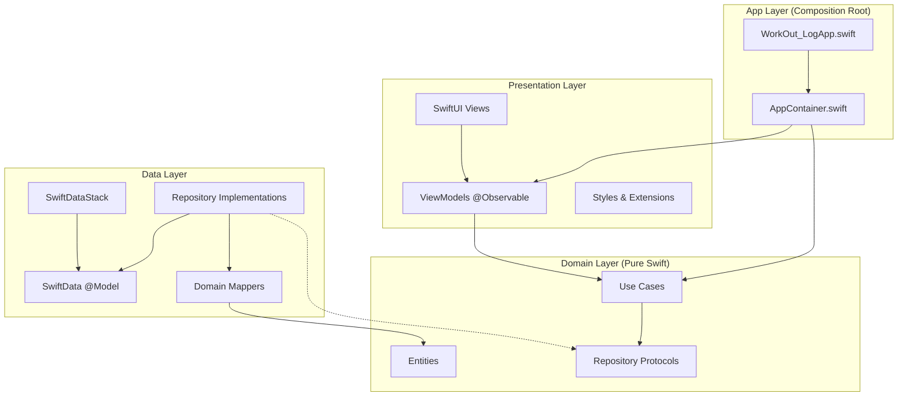

# ADR-002: Clean Architecture with Global Layering Principles

**Status**: Accepted
**Date**: 2025-10-14
**Decision Makers**: iOS Development Team

## Context

WorkOut Log requires a maintainable, testable architecture that can scale from Week 1 CRUD operations through Week 3 analytics features. The codebase needs clear separation of concerns, framework independence for business logic, and support for comprehensive testing.

## Decision

We will implement **Clean Architecture** with strict global layering principles across the entire application.

## Architecture Overview



## Layer Responsibilities

### App Layer (Composition Root)
**Purpose**: Object graph construction and dependency injection
**Files**: `AppContainer.swift`, `WorkOut_LogApp.swift`

```swift
@MainActor
final class AppContainer {
    // Infrastructure
    let modelContainer: ModelContainer
    let modelContext: ModelContext

    // Repositories (Data → Domain)
    let sessionRepo: SessionRepository
    let exerciseRepo: ExerciseRepository

    // Use Cases (Domain)
    let createSession: CreateSessionUseCase
    let addSet: AddSetUseCase

    init() {
        // 1. Setup infrastructure
        self.modelContainer = try! SwiftDataStack.container()
        self.modelContext = ModelContext(modelContainer)

        // 2. Initialize repositories
        self.sessionRepo = SessionRepositoryImpl(context: modelContext)

        // 3. Wire use cases
        self.createSession = CreateSessionUseCase(repo: sessionRepo)
    }
}
```

### Presentation Layer
**Purpose**: UI logic and user interaction
**Dependencies**: Domain layer only
**Restrictions**: No direct Data layer imports

```swift
@MainActor @Observable
final class SessionListViewModel {
    var sessions: [SessionUI] = []
    private let container: AppContainer

    init(container: AppContainer) {
        self.container = container
    }

    func createToday() {
        Task {
            _ = try await container.createSession(date: .now, note: nil)
            await refresh()
        }
    }
}
```

### Domain Layer (Pure Swift)
**Purpose**: Business logic and core entities
**Dependencies**: None (pure Swift)
**Restrictions**: No SwiftUI, SwiftData, or framework imports

```swift
// Pure Swift entity
public struct WorkoutSession: Sendable, Equatable, Identifiable {
    public let id: String
    public var date: Date
    public var note: String?
}

// Single-responsibility use case
public struct CreateSessionUseCase {
    let repo: SessionRepository

    public func callAsFunction(date: Date, note: String?) async throws -> WorkoutSession {
        let session = WorkoutSession(id: UUID().uuidString, date: date, note: note)
        try await repo.create(session: session)
        return session
    }
}

// Abstract repository protocol
public protocol SessionRepository {
    func create(session: WorkoutSession) async throws
    func fetchRange(start: Date, end: Date) async throws -> [WorkoutSession]
}
```

### Data Layer
**Purpose**: Persistence and external data access
**Dependencies**: Domain layer for protocols and entities
**Restrictions**: No Presentation layer imports

```swift
// SwiftData model (Data layer)
@Model final class WorkoutSessionModel {
    @Attribute(.unique) var id: String
    var date: Date
    var note: String?

    @Relationship(deleteRule: .cascade) var sets: [SetRecordModel] = []
}

// Domain mapper
extension WorkoutSessionModel {
    func toDomain() -> WorkoutSession {
        WorkoutSession(id: id, date: date, note: note)
    }

    static func fromDomain(_ session: WorkoutSession) -> WorkoutSessionModel {
        WorkoutSessionModel(id: session.id, date: session.date, note: session.note)
    }
}

// Repository implementation
final class SessionRepositoryImpl: SessionRepository {
    private let context: ModelContext

    func create(session: WorkoutSession) async throws {
        let model = WorkoutSessionModel.fromDomain(session)
        context.insert(model)
        try context.save()
    }
}
```

## Dependency Rules

### 1. Unidirectional Flow
```
Presentation → Domain ← Data
```
- **Presentation** depends on Domain
- **Data** depends on Domain
- **Domain** depends on nothing

### 2. Interface Segregation
Each layer communicates through focused interfaces:
- **Use Cases**: Single-responsibility business operations
- **Repository Protocols**: Abstract data access contracts
- **Entities**: Pure business models

### 3. Dependency Inversion
High-level modules (Domain) define interfaces; low-level modules (Data) implement them.

## Testing Strategy

### Unit Tests (Domain Focus)
```swift
final class CreateSessionUseCaseTests: XCTestCase {
    var mockRepo: InMemorySessionRepository!
    var useCase: CreateSessionUseCase!

    override func setUpWithError() throws {
        mockRepo = InMemorySessionRepository()
        useCase = CreateSessionUseCase(repo: mockRepo)
    }

    func test_createSession_persistsCorrectly() async throws {
        // Given
        let date = Date()
        let note = "Leg day"

        // When
        let session = try await useCase(date: date, note: note)

        // Then
        XCTAssertEqual(session.note, note)
        let fetched = try await mockRepo.fetch(by: session.id)
        XCTAssertEqual(fetched?.note, note)
    }
}
```

### Mock Repositories
```swift
final class InMemorySessionRepository: SessionRepository {
    var sessions: [String: WorkoutSession] = [:]

    func create(session: WorkoutSession) async throws {
        sessions[session.id] = session
    }

    func fetch(by id: String) async throws -> WorkoutSession? {
        return sessions[id]
    }
}
```

## Alternatives Considered

### MVC (Model-View-Controller)
**Pros**: Simple, familiar pattern
**Cons**: Tight coupling, massive view controllers, poor testability
**Verdict**: Rejected - doesn't scale for complex business logic

### MVVM without Clean Architecture
**Pros**: Good separation of UI logic
**Cons**: ViewModels often become bloated, business logic mixed with presentation
**Verdict**: Rejected - lacks business logic isolation

### VIPER (View-Interactor-Presenter-Entity-Router)
**Pros**: Very strict separation, good for large teams
**Cons**: Over-engineered for medium apps, excessive boilerplate
**Verdict**: Rejected - too complex for WorkOut Log scope

### Redux/TCA (The Composable Architecture)
**Pros**: Predictable state management, excellent for complex UI flows
**Cons**: Steep learning curve, verbose for simple CRUD operations
**Verdict**: Deferred - consider for Week 4 if state complexity increases

## Trade-offs

### Accepted Trade-offs
1. **Initial Complexity**: More files and abstractions than simpler patterns
2. **Boilerplate**: Repository interfaces and implementations
3. **Learning Curve**: Team needs Clean Architecture understanding

### Benefits Gained
1. **Testability**: Isolated business logic with mock dependencies
2. **Maintainability**: Clear boundaries and single responsibilities
3. **Framework Independence**: Domain logic survives UI framework changes
4. **Scalability**: Architecture supports Week 2-3 feature expansion

## Implementation Guidelines

### Module Structure
```
WorkOut Log/
├── App/DI/                     # Composition Root
├── Presentation/Scenes/        # Views & ViewModels
├── Domain/                     # Pure Swift (Entities, Use Cases, Protocols)
└── Data/                       # SwiftData, Repositories, Mappers
```

### Import Rules
```swift
// ✅ Domain Layer - Pure Swift only
// No imports allowed

// ✅ Presentation Layer
import SwiftUI
import workout_log  // Domain module access

// ✅ Data Layer
import SwiftData
import workout_log  // Domain module access
```

### Naming Conventions
- **Entities**: Noun (WorkoutSession, Exercise)
- **Use Cases**: Verb + Noun + UseCase (CreateSessionUseCase)
- **Repositories**: Noun + Repository (SessionRepository)
- **ViewModels**: Screen + ViewModel (SessionListViewModel)

## Success Metrics

### Code Quality
- **Testability**: 80%+ unit test coverage for Domain layer
- **Coupling**: Zero framework imports in Domain layer
- **Cohesion**: Single responsibility per use case

### Developer Experience
- **Build Time**: Under 30 seconds for clean builds
- **Feature Velocity**: New CRUD features in 1-2 hours
- **Bug Rate**: Sub-5% regression rate between releases

## Implementation Status

**Week 1**: ✅ Complete
- Basic Clean Architecture with Session/SetRecord entities
- Repository pattern with SwiftData implementations
- Use cases for core CRUD operations
- Mock repositories for unit testing

**Week 2**: 🚧 Planned Extensions
- Exercise and BodyMetric domain expansion
- Analytics use cases (volume computation, PR tracking)
- Advanced repository queries

**Week 3**: 📋 Planned Polish
- Performance optimization
- Advanced testing patterns
- Documentation and ADRs

---

**Last Updated**: 2025-10-14
**Next Review**: End of Week 2 implementation