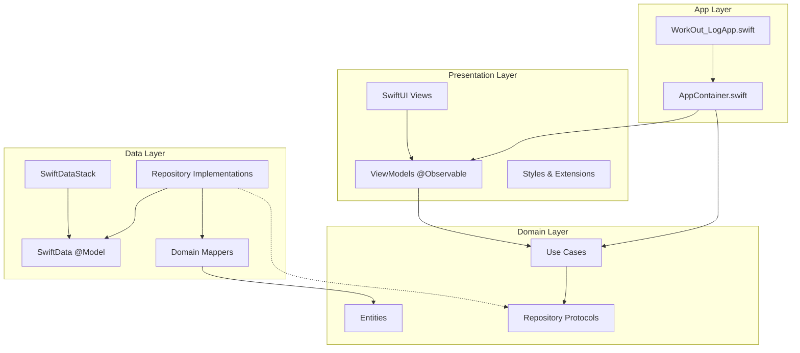
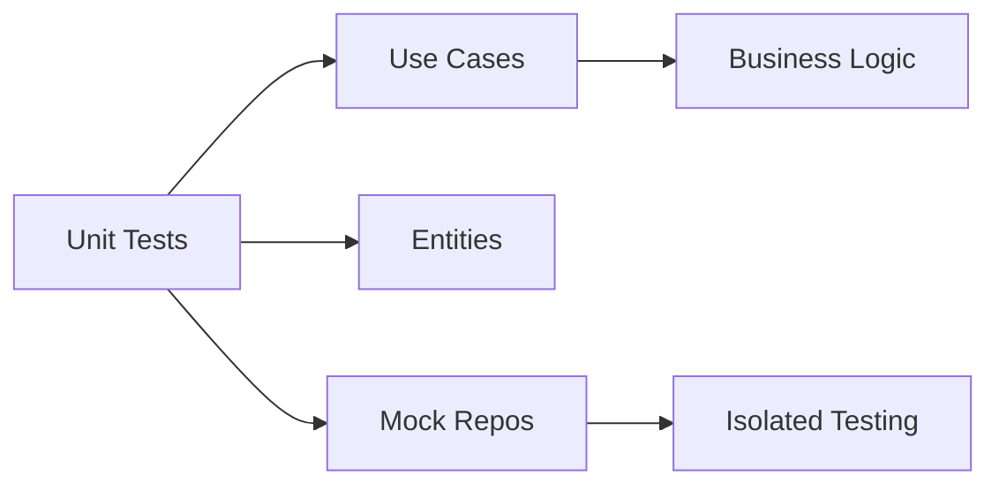

# WorkOut Log Developer Guide

A comprehensive guide to the workout tracking app's architecture, patterns, and development practices.

## Table of Contents

1. [Project Overview](#project-overview)
2. [Architecture & Layers](#architecture--layers)
3. [Dependency Injection](#dependency-injection)
4. [Domain Layer](#domain-layer)
5. [Data Layer & SwiftData](#data-layer--swiftdata)
6. [Presentation Layer](#presentation-layer)
7. [Testing Strategy](#testing-strategy)
8. [Accessibility Guidelines](#accessibility-guidelines)
9. [CI/CD Pipeline](#cicd-pipeline)

## Project Overview

WorkOut Log is a modern iOS app built with **Swift 6**, **SwiftUI**, and **SwiftData**, following **Clean Architecture** principles for maintainability and testability.

### Core Goals
- **Clean separation of concerns** across architectural layers
- **Pure domain logic** independent of frameworks
- **Comprehensive testing** at all layers
- **Accessibility-first design** for inclusive user experience
- **Type-safe persistence** with SwiftData relationships

## Architecture & Layers



### Layer Responsibilities

#### App Layer (Composition Root)
- **AppContainer.swift**: Dependency injection and object graph construction
- **WorkOut_LogApp.swift**: App lifecycle and root view configuration

#### Presentation Layer
- **Views**: SwiftUI views with accessibility identifiers
- **ViewModels**: `@Observable` pattern for state management
- **Navigation**: Declarative routing between screens

#### Domain Layer (Pure Swift)
- **Entities**: Core business models (WorkoutSession, SetRecord, Exercise)
- **Use Cases**: Single-responsibility business operations
- **Repository Protocols**: Abstract data access contracts

#### Data Layer
- **Repository Implementations**: Concrete data access using SwiftData
- **SwiftData Models**: `@Model` classes with relationships
- **Mappers**: Bidirectional conversion between Domain and Data models

## Dependency Injection

### AppContainer Pattern

The app uses a **Composition Root** pattern via `AppContainer`:

```swift
@MainActor
final class AppContainer {
    // Infrastructure
    let modelContainer: ModelContainer
    let modelContext: ModelContext

    // Repositories
    let sessionRepo: SessionRepository
    let exerciseRepo: ExerciseRepository

    // Use Cases
    let createSession: CreateSessionUseCase
    let addSet: AddSetUseCase
    // ...

    init() {
        // 1. Setup infrastructure
        self.modelContainer = try! SwiftDataStack.container()
        self.modelContext = ModelContext(modelContainer)

        // 2. Initialize repositories
        self.sessionRepo = SessionRepositoryImpl(context: modelContext)

        // 3. Wire use cases
        self.createSession = CreateSessionUseCase(repo: sessionRepo)
    }
}
```

### Injection Strategy
- **Constructor injection** for required dependencies
- **Single instance** of AppContainer per app session
- **@MainActor** isolation for UI-bound components

## Domain Layer

### Core Entities

```mermaid
classDiagram
    class WorkoutSession {
        +String id
        +Date date
        +String? note
    }

    class SetRecord {
        +String id
        +String sessionID
        +String exerciseID
        +Double weight
        +Int reps
        +Int order
        +Double volume
    }

    class Exercise {
        +String id
        +String name
        +ExerciseCategory category
    }

    class BodyMetric {
        +String id
        +Date date
        +Double bodyWeight
        +Double? bodyFatPercent
        +Double? muscleMass
    }

    WorkoutSession ||--o{ SetRecord : contains
    Exercise ||--o{ SetRecord : references
```

### Use Case Pattern

Each use case represents a **single business operation**:

```swift
public struct CreateSessionUseCase {
    let repo: SessionRepository

    public func callAsFunction(date: Date, note: String?) async throws -> WorkoutSession {
        let session = WorkoutSession(
            id: UUID().uuidString,
            date: date,
            note: note
        )
        try await repo.create(session: session)
        return session
    }
}
```

### Repository Protocols

Abstract data access without framework coupling:

```swift
public protocol SessionRepository {
    func create(session: WorkoutSession) async throws
    func fetchRange(start: Date, end: Date) async throws -> [WorkoutSession]
    func add(set: SetRecord) async throws
    func fetchSets(sessionID: String) async throws -> [SetRecord]
}
```

## Data Layer & SwiftData

### SwiftData Configuration Rules

#### 1. Predicate Syntax (CRITICAL)
```swift
// ✅ CORRECT: Explicit generic
let predicate = #Predicate<WorkoutSessionModel> { $0.date >= start }

// ❌ WRONG: Missing generic
let predicate = #Predicate { $0.date >= start }
```

#### 2. FetchDescriptor Limits
```swift
// ✅ CORRECT: Property-based limit
var descriptor = FetchDescriptor<WorkoutSessionModel>(predicate: predicate)
descriptor.fetchLimit = 1

// ❌ WRONG: Constructor parameter
let descriptor = FetchDescriptor(predicate: predicate, fetchLimit: 1)
```

#### 3. Sort Descriptors
```swift
// ✅ CORRECT: Qualified name
let sort = [SortDescriptor(\WorkoutSessionModel.date, order: .reverse)]
```

### Model Relationships

```swift
@Model final class WorkoutSessionModel {
    @Attribute(.unique) var id: String
    var date: Date
    var note: String?

    // One-to-many relationship
    @Relationship(deleteRule: .cascade) var sets: [SetRecordModel] = []
}

@Model final class SetRecordModel {
    @Attribute(.unique) var id: String
    var sessionID: String
    var weight: Double
    var reps: Int
    var order: Int

    // Inverse relationship
    @Relationship(inverse: \WorkoutSessionModel.sets)
    var session: WorkoutSessionModel?
}
```

### Domain Mappers

Bidirectional conversion between layers:

```swift
extension WorkoutSessionModel {
    func toDomain() -> WorkoutSession {
        WorkoutSession(id: id, date: date, note: note)
    }

    static func fromDomain(_ session: WorkoutSession) -> WorkoutSessionModel {
        WorkoutSessionModel(id: session.id, date: session.date, note: session.note)
    }
}
```

## Presentation Layer

### Observable Pattern (iOS 18+)

```swift
@MainActor @Observable
final class SessionListViewModel {
    var sessions: [SessionUI] = []
    private let container: AppContainer

    init(container: AppContainer) {
        self.container = container
    }

    func createToday() {
        Task {
            _ = try await container.createSession(date: .now, note: nil)
            await refresh()
        }
    }
}
```

### View Integration

```swift
struct SessionListView: View {
    @State var vm: SessionListViewModel

    var body: some View {
        NavigationStack {
            List(vm.sessions) { session in
                // Session row
            }
            .toolbar {
                Button("오늘 생성") { vm.createToday() }
                    .accessibilityIdentifier("createTodayButton")
            }
        }
    }
}
```

### Navigation Pattern

```swift
// Declarative navigation with type-safe IDs
.navigationDestination(for: String.self) { sessionID in
    SessionDetailView(sessionID: sessionID, container: container)
}
```

## Testing Strategy

### Unit Tests (Domain Focus)



#### Test Structure
```swift
final class CreateSessionUseCaseTests: XCTestCase {
    var mockRepo: InMemorySessionRepository!
    var useCase: CreateSessionUseCase!

    override func setUpWithError() throws {
        mockRepo = InMemorySessionRepository()
        useCase = CreateSessionUseCase(repo: mockRepo)
    }

    func test_createSession_persistsCorrectly() async throws {
        // Given
        let date = Date()
        let note = "Leg day"

        // When
        let session = try await useCase(date: date, note: note)

        // Then
        XCTAssertEqual(session.note, note)
        let fetched = try await mockRepo.fetch(by: session.id)
        XCTAssertEqual(fetched?.note, note)
    }
}
```

### UI Tests (Flow Validation)

```swift
final class SessionListUITests: XCTestCase {
    var app: XCUIApplication!

    func test_createTodayButton_createsSession() throws {
        let createButton = app.buttons["createTodayButton"]
        XCTAssertTrue(createButton.exists)

        let initialCount = app.tables.cells.count
        createButton.tap()

        // Verify session was created
        XCTAssertGreaterThan(app.tables.cells.count, initialCount)
    }
}
```

### Mock Repositories

Lightweight in-memory implementations for testing:

```swift
final class InMemorySessionRepository: SessionRepository {
    var sessions: [String: WorkoutSession] = [:]
    var sets: [String: [SetRecord]] = [:]

    func create(session: WorkoutSession) async throws {
        sessions[session.id] = session
    }

    func fetchSets(sessionID: String) async throws -> [SetRecord] {
        return sets[sessionID, default: []].sorted { $0.order < $1.order }
    }
}
```

## Accessibility Guidelines

### Checklist for All Views

#### Identifiers (Required for UI Tests)
```swift
Button("Add Set") { addSet() }
    .accessibilityIdentifier("addSetButton")

TextField("Weight", text: $weight)
    .accessibilityIdentifier("weightInput")
```

#### Labels & Traits
```swift
Text("\(totalVolume) kg")
    .accessibilityLabel("Total volume: \(totalVolume) kilograms")
    .accessibilityAddTraits(.summaryElement)
```

#### Dynamic Type Support
```swift
Text("Session Detail")
    .font(.title)                    // Scales automatically
    .minimumScaleFactor(0.8)         // Prevent extreme scaling
```

#### VoiceOver Navigation
```swift
VStack {
    Text("Session on \(date)")
        .accessibilityHeading(.h1)   // Semantic structure

    List(sets) { set in
        HStack {
            Text("#\(set.order + 1)")
                .accessibilityHidden(true)  // Redundant for VoiceOver
            Text("\(set.weight)kg × \(set.reps) reps")
                .accessibilityLabel("Set \(set.order + 1): \(set.weight) kilograms, \(set.reps) repetitions")
        }
    }
}
```

### Testing Accessibility

```swift
func test_sessionList_accessibilityElements() throws {
    let createButton = app.buttons["createTodayButton"]
    XCTAssertTrue(createButton.isHittable)
    XCTAssertEqual(createButton.label, "오늘 생성")
}
```

## CI/CD Pipeline

### GitHub Actions Workflow

```yaml
name: CI

on:
  push:
    branches: [ main, develop ]
  pull_request:
    branches: [ main ]

jobs:
  test:
    name: Unit Tests
    runs-on: macos-latest

    steps:
    - name: Checkout
      uses: actions/checkout@v4

    - name: Select Xcode
      run: sudo xcode-select -s /Applications/Xcode_16.0.app

    - name: Build and Test
      run: |
        xcodebuild -scheme workout_log \
                   -destination 'platform=iOS Simulator,name=iPhone 16' \
                   clean build test
```

### Local Development Commands

```bash
# Clean build
xcodebuild -scheme workout_log \
           -destination 'platform=iOS Simulator,name=iPhone 16' \
           clean build

# Run unit tests
xcodebuild -scheme workout_log \
           -destination 'platform=iOS Simulator,name=iPhone 16' \
           test

# Run UI tests (when available)
xcodebuild -scheme workout_logUITests \
           -destination 'platform=iOS Simulator,name=iPhone 16' \
           test
```

### Code Quality Checks

1. **Swift Lint**: Code style consistency
2. **Unit Test Coverage**: Minimum 80% for Domain layer
3. **UI Test Coverage**: Critical user flows
4. **Accessibility Audit**: VoiceOver navigation
5. **Performance Testing**: Launch time and memory usage

---

## Quick Reference

### Common Patterns

| Pattern | Usage | Example |
|---------|-------|---------|
| Use Case | Single business operation | `CreateSessionUseCase` |
| Repository | Data access abstraction | `SessionRepository` |
| Entity | Pure domain model | `WorkoutSession` |
| ViewModel | Presentation state | `SessionListViewModel` |
| Mapper | Layer conversion | `WorkoutSessionModel.toDomain()` |

### SwiftData Rules Summary

1. **Always** use `#Predicate<Model>` with explicit generic
2. **Always** set `fetchLimit` via property, not constructor
3. **Always** use qualified `SortDescriptor`
4. **Always** define bidirectional relationships with inverse
5. **Never** import SwiftData in Domain layer

### Testing Guidelines

1. **Unit tests** focus on business logic isolation
2. **UI tests** verify critical user flows
3. **Mock repositories** for fast, reliable tests
4. **Accessibility identifiers** for all interactive elements
5. **Test naming** follows `test_condition_expectedResult` pattern

This guide serves as the single source of truth for development practices in the WorkOut Log app. Keep it updated as the architecture evolves.