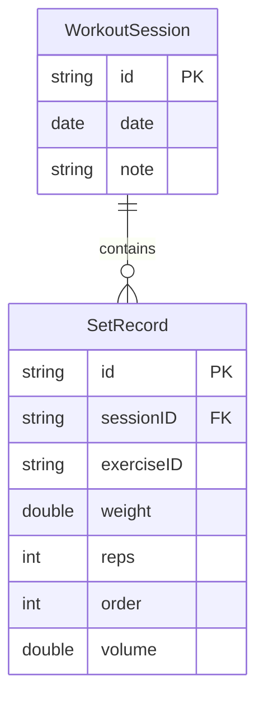

# WorkOut Log

A modern workout tracking app built with SwiftUI, SwiftData, and Clean Architecture for iOS 18+.

## Features

### Week 1 (CRUD Essentials) ✅
- [x] Session management (create, view, list)
- [x] Set tracking with live updates
- [x] Real-time volume calculation
- [x] SwiftData persistence with proper relationships
- [x] Clean Architecture (Presentation → Domain ← Data)
- [x] Comprehensive unit and UI tests

### Week 2 (Insights & Analytics) 🚧
- [ ] Exercise categories and management
- [ ] Weekly & monthly volume charts by category
- [ ] Personal Records (PR) tracking with Epley 1RM
- [ ] Body metrics tracking (weight, body fat %, muscle mass)

### Week 3 (Polish & Release) 🚧
- [ ] Accessibility improvements (VoiceOver, Dynamic Type)
- [ ] Snapshot tests for key screens
- [ ] Complete documentation with ADRs
- [ ] Export documentation scripts

## Architecture

This app follows **Global Clean Architecture** principles:

```mermaid
graph TB
    subgraph "Presentation Layer"
        UI[Views & ViewModels]
        OBS[@Observable Pattern]
    end

    subgraph "Domain Layer"
        ENT[Entities]
        UC[Use Cases]
        REPO[Repository Protocols]
    end

    subgraph "Data Layer"
        IMPL[Repository Implementations]
        SD[SwiftData Models]
        MAP[Domain Mappers]
    end

    UI --> UC
    OBS --> UC
    UC --> REPO
    IMPL --> REPO
    IMPL --> SD
    IMPL --> MAP
    MAP --> ENT
```

### Key Principles
- **Domain** is pure Swift (no SwiftUI/SwiftData imports)
- **Presentation** only knows Domain entities and use cases
- **Data** implements Domain protocols and handles persistence
- **Unidirectional dependency flow**: Presentation → Domain ← Data

## Tech Stack

- **iOS 18.6+** / **Swift 6** (strict concurrency)
- **SwiftUI** with **Observation** framework (`@Observable`)
- **SwiftData** for local persistence
- **Charts** framework for data visualization (Week 2)
- **XCTest** for unit and UI testing

## Project Structure

```
WorkOut Log/
├── App/
│   ├── DI/AppContainer.swift        # Dependency injection container
│   └── WorkOut_LogApp.swift         # App entry point
├── Presentation/
│   └── Scenes/
│       ├── SessionList/             # Session overview & management
│       └── SessionDetail/           # Set tracking & volume display
├── Domain/
│   ├── Entities/                    # Pure Swift domain models
│   ├── UseCases/                    # Business logic operations
│   └── Repositories/                # Abstract data access protocols
├── Data/
│   ├── SwiftDataModels/             # @Model classes for persistence
│   ├── Repositories/                # Repository implementations
│   ├── Mappers/                     # Domain ↔ Data conversion
│   └── Persistence/                 # SwiftData configuration
└── Tests/
    ├── DomainTests/                 # Unit tests for business logic
    └── UITests/                     # Integration & flow tests
```

## Getting Started

### Prerequisites
- **Xcode 16+**
- **iOS 18.6+ Simulator or Device**
- **Git** for version control

### Build & Run

```bash
# Clone the repository
git clone https://github.com/jungseok-corine/WorkOut_Log.git
cd WorkOut_Log

# Open in Xcode
open "WorkOut Log.xcodeproj"

# Or build from command line
xcodebuild -scheme workout_log -destination 'platform=iOS Simulator,name=iPhone 16' build
```

### Run Tests

```bash
# Unit tests (Domain layer)
xcodebuild -scheme workout_log -destination 'platform=iOS Simulator,name=iPhone 16' test

# UI tests (Integration)
xcodebuild -scheme workout_logUITests -destination 'platform=iOS Simulator,name=iPhone 16' test
```

## Usage Guide

### Basic Workflow
1. **Create Session**: Tap "오늘 생성" to create a workout session for today
2. **Add Sets**: In session detail, enter weight and reps, then tap "Add Set"
3. **View Progress**: Session list shows total volume for each workout
4. **Clone Workouts**: Use "최근 복제" to repeat your last workout structure

### Data Model



## Development Guidelines

### Architecture Rules (MUST FOLLOW)
- **Domain Layer**: No imports of SwiftUI, SwiftData, Charts
- **SwiftData**: Use `#Predicate<Model>` with explicit generics
- **FetchDescriptor**: Set `fetchLimit` via property, not constructor
- **ViewModels**: Prefer `@MainActor + @Observable` over Combine
- **Tests**: Use `@testable import workout_log` for module access

### SwiftData Best Practices
```swift
// ✅ Correct: Explicit generic and property-based limit
let predicate = #Predicate<WorkoutSessionModel> { $0.date >= start }
var descriptor = FetchDescriptor<WorkoutSessionModel>(predicate: predicate)
descriptor.fetchLimit = 1

// ❌ Incorrect: No generic and constructor limit
let predicate = #Predicate { $0.date >= start }
let descriptor = FetchDescriptor(predicate: predicate, fetchLimit: 1)
```

### Observation Pattern
```swift
// ✅ Week 1 approach (iOS 18+)
@MainActor @Observable
final class SessionListViewModel {
    var sessions: [SessionUI] = []
    // ...
}

// In SwiftUI View
@State var vm: SessionListViewModel
```

## Contributing

1. **Fork** the repository
2. **Create** a feature branch (`git checkout -b feat/amazing-feature`)
3. **Follow** Clean Architecture boundaries
4. **Add** unit tests for new use cases
5. **Use** Conventional Commits (`feat:`, `fix:`, `test:`, etc.)
6. **Submit** a Pull Request

### Commit Message Format
```
<type>(<scope>): <description>

<body>

<footer>
```

Example:
```
feat(domain): add exercise categories and search functionality

- Implement ExerciseCategory enum with 7 muscle groups
- Add SearchExercisesUseCase with category filtering
- Update Exercise entity to use structured categories

Closes #123
```

## Week 2-3 Roadmap

### Week 2: Insights & Analytics
- **Exercise Management**: Categories, search, recent picks
- **Volume Charts**: Weekly/monthly stacked charts by muscle group
- **Personal Records**: Max weight tracking with Epley 1RM estimates
- **Body Metrics**: Weight, body fat %, muscle mass tracking over time

### Week 3: Polish & Release
- **Accessibility**: VoiceOver support, Dynamic Type scaling
- **Documentation**: ADRs, developer guide, export scripts
- **Testing**: Snapshot tests for visual regression detection
- **CI/CD**: Automated builds, test reports, deployment pipeline

## License

MIT License - see [LICENSE](LICENSE) for details.

---

**Built with ❤️ using Swift 6, SwiftUI, and Clean Architecture principles.**

Current Status: **Week 1 Complete** - Full CRUD operations with live volume tracking